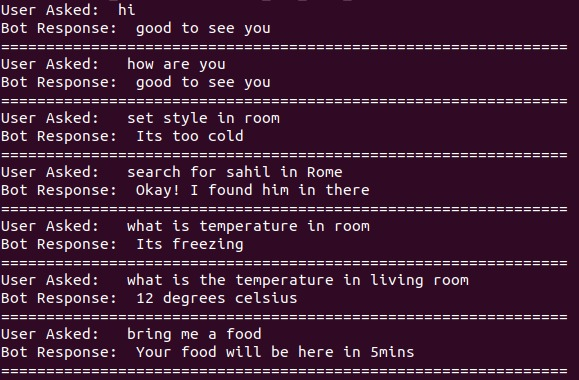

<!-- TABLE OF CONTENTS -->
## Table of Contents

* [About the Project](#about-the-project)
* [Prerequisites](#prerequisites)
* [Getting Started](#getting-started)
  * [Installation of TurtleBot 3 Package](#Installation-of-TurtleBot-3-Package)
  * [Steps to Setup Google Speech to Text on Google Cloud](#Steps-to-Setup-Google-Speech-to-Text-on-Google-Cloud)
  * [Steps to Setup Environmental Variable for Credential on RB5](#Steps-to-Setup-Environmental-Variable-for-Credential-on-RB5)
  * [Steps to Setup the Google Text to Speech on Google Cloud](#Steps-to-Setup-the-Google-Text-to-Speech-on-Google-Cloud)
  * [Steps to Setup Virtualenv for Google STT & TTS](#Steps-to-Setup-Virtualenv-for-Google-STT-&-TTS)
  * [Installing Application dependencies](#Installing-Application-dependencies)
  * [Steps to Flash ROS2 Firmware into OpenCR](#Steps-to-Flash-ROS2-Firmware-into-OpenCR)
* [Usage](#usage)

<!-- ABOUT THE PROJECT -->
## About The Project

This project is intended to build and deploy an interactive communication robot on the RB5 platform. It responds to the set of queries or questions which are being asked to the system by any human being.

## Prerequisites

1. A Linux workstation with Ubuntu 18.04.

2. Install Android Platform tools (ADB, Fastboot) 

3. Download and install the SDK [Manager](https://developer.qualcomm.com/qualcomm-robotics-rb5-kit/quick-start-guide/qualcomm_robotics_rb5_development_kit_bring_up/download-and-install-the-SDK-manager)

4. [Flash](https://developer.qualcomm.com/qualcomm-robotics-rb5-kit/quick-start-guide/qualcomm_robotics_rb5_development_kit_bring_up/flash-images) the RB5 firmware image on to the board

5. Setup the [Network](https://developer.qualcomm.com/qualcomm-robotics-rb5-kit/quick-start-guide/qualcomm_robotics_rb5_development_kit_bring_up/set-up-network) 

6. Turtlebot burger is assembled, operational and is connected to RB5

7. RB5 Vision Mezzanine Board

<!-- GETTING STARTED -->
## Getting Started

To get a local copy up and running follow these steps.
1. Clone the project repository from the github to RB5.
```sh
adb shell
git clone https://github.com/globaledgesoft/audio-based-chatbot-rb5.git
```

### Installation of TurtleBot 3 Package
For the setup we will be using the TurtleBot3 Burger, we need to install TurtleBot Packages for controlling the TurtleBot.  

1. Setup the necessary packages by executing the following commands.
```sh
sudo apt install python3-argcomplete python3-colcon-common-extensions libboost-system-dev build-essential
```
2. Create a new directory for TurtleBot 3.
```sh
mkdir -p ~/turtlebot3_ws/src && cd ~/turtlebot3_ws/src
```
3. Clone the necessary repositories and then access TurtleBot Folder
```sh
git clone -b dashing-devel https://github.com/ROBOTIS-GIT/hls_lfcd_lds_driver.git
git clone -b dashing-devel https://github.com/ROBOTIS-GIT/turtlebot3_msgs.git
git clone -b dashing-devel https://github.com/ROBOTIS-GIT/turtlebot3.git
git clone -b dashing-devel https://github.com/ROBOTIS-GIT/DynamixelSDK.git
cd ~/turtlebot3_ws/src/turtlebot3
```
4. Remove the folders that are not required for the current project.
```sh
rm -r turtlebot3_cartographer turtlebot3_navigation2
cd ~/turtlebot3_ws/
```
5. Source & Building the TurtleBot3 Setup file
```sh
echo 'source /opt/ros/dashing/setup.bash' >> ~/.bashrc
source ~/.bashrc
colcon build --symlink-install --parallel-workers 1
echo 'source ~/turtlebot3_ws/install/setup.bash' >> ~/.bashrc
source ~/.bashrc
echo 'export ROS_DOMAIN_ID=30 #TURTLEBOT3' >> ~/.bashrc
echo 'export TURTLEBOT3_MODEL=burger' >> ~/.bashrc
source ~/.bashrc
```

### Steps to Setup Google Speech to Text on Google Cloud
1. Open the link given below, to Create the new project. Click on the Set up a Project Button
https://cloud.google.com/speech-to-text/docs/quickstart-gcloud

2. Open the link given below, and Enable the Google Speech to Text on your Google Cloud account. Make sure you have Enabled the Google Cloud Account and uploaded the billing details. 
https://console.cloud.google.com/marketplace/product/google/speech.googleapis.com

3. Create the Service Account from the link given below.
https://console.cloud.google.com/iam-admin/serviceaccounts

Now follow the steps as shown in the images


Grant the Owner access to the Service account by clicking on Owner.


Once done, with the step Click on the Done Button.
This step will create the service account for the project, now create the Private key for this service account.

4.Add Key for the Service Account created in the previous Step, follow the steps as shown below.
Click on Manage Keys button


Click on Add key, and Choose the Create a Key from the drop-down list.


Select Json in options shown while creating a new key


The steps given above will download the Private Key for the Service account for the Created Project.

### Steps to Setup Environmental Variable for Credential on RB5
1. Copy the Downloaded Private key file(JSON File) to the RB5 using SCP or ADB. 
2. Login to the RB5 board using SSH.
3. Run the command given below to set the environment variable.set GOOGLE_APPLICATION_CREDENTIALS to the path of the JSON file that contains your service account key.
```sh
root@qrb5165-rb5:~ export GOOGLE_APPLICATION_CREDENTIALS="KEY_FILE_PATH"
```

NOTE: Add the above command in ~/.bashrc file to keep GOOGLE_APPLICATION_CREDENTIALS initialized all the time.
4. Source the ~/.bashrc file if you are trying to use the same terminal after adding GOOGLE_APPLICATION_CREDENTIAL in the .bashrc file.
```sh
root@qrb5165-rb5:~ source ~/.bashrc
```

### Steps to Setup the Google Text to Speech on Google Cloud
Open the link given below, to Create the new project. Click on the Set up a Project Button on the website.
https://console.cloud.google.com/marketplace/product/google/texttospeech.googleapis.com


### Steps to Setup Virtualenv for Google STT & TTS
1. We need to create the virtualenv in python in order to install the libraries of Google STT & TTS. Run the set of commands given below to install the library.
```sh
cd <PROJECT_ROOT_DIR>
pip install virtualenv
virtualenv stt
source stt/bin/activate
(stt): stt/bin/pip install google-cloud-speech
(stt): stt/bin/pip install google-cloud-texttospeech
```
### Installing Application dependencies
1. Installing dependencies for Audio Recorder
```sh
apt install portaudio19-dev
stt/bin/pip install pyaudio
```

### Steps to Flash ROS2 Firmware into OpenCR
The Default firmware supports ROS 1. As we are using ROS Dashing (ROS 2 version), we need to upgrade OpenCR firmware.
1. Create a temp folder for Binaries
```sh
mkdir /home/opencrbin/ && cd /home/opencrbin
```
2. Download the latest binaries & unzip
```sh
wget https://github.com/ROBOTIS-GIT/OpenCR-Binaries/raw/master/turtlebot3/ROS2/latest/opencr_update.tar.bz2
tar -xjf ./opencr_update.tar.bz2
```
3. Set the OpenCR port & TurtleBot Model. Before flashing, check whether ttyACM0 port exists.
```sh
export OPENCR_PORT=/dev/ttyACM0
export OPENCR_MODEL=burger
```
4. Upload the latest firmware by following command:
```sh
cd /home/opencrbin/opencr_update && ./update.sh $OPENCR_PORT $OPENCR_MODEL.opencr
```

<!-- USAGE -->
## Usage
Follow the below steps for running the application:
1. Access the RB5 through adb
```sh
adb shell
cd <PROJECT_ROOT_DIR>
source stt/bin/activate
```
2. To run the application execute the following command in shell
```sh
python3 main.py
```

3. Once the application starts running, start asking queries to the robot. Below is an example of output from robot. 


NOTE: This above conversation between bot & user is tested on RB5 Vision development kit. The kit contains a Mezzanine board along with mic & Connected speaker.


